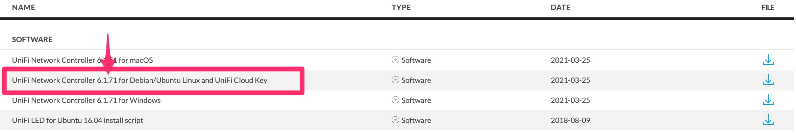

# Unifi controller fixed
This script remove the  old version mongodb dependecies required from unifi controller.

### Usage
```bash
unifi-constroller.sh <unifi_controller_version> [temp_folder]
```

### How to find latest unifi controller
Navigate to the official unifi site at https://www.ui.com/download/unifi/ and search "controller".
